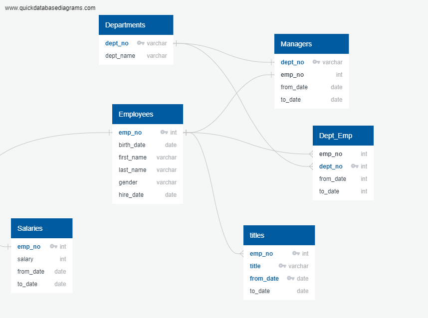
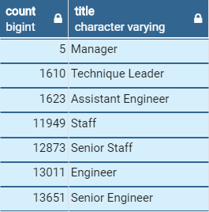
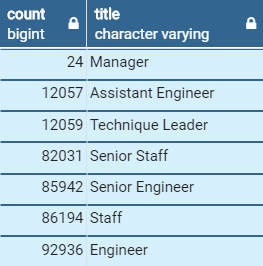

# Pewlett-Hackard-Analysis
## A Human Resource analysis to help near retirement empployees, future vacancies and mentorship programs

### Background
Pewlett-Hackard is a large company that is starting to notice that the 'Baby Boomers' within the company are retiring at an alarming rate.  With the help of a Human Resource analyst, the company is planning to:
* provide retirement packages to those who meet certain criteria
* identify positions that need to be filled in the near future as a result of the thousands of vacancies that may open up

However, all of the employee information is within a data-set.  This data-set comprises of 6 csv files which has the essential information to identify the retirement criteria.

### Relationship Between the Employee Data-Set Files
The first step of the analysis was to inspect the data-set and identify the headers which contain the relevant employee information.  Subsequently, an 'Entity Relationship Diagram (ERD)' was constructed after assigning the primary and foreign keys of the files.  Below is the final ERD from this data-set.

### Total Number of Employee Titles Retiring

Using the employees and depart_emp csv files, a retirement eligible list of employees was built.  The criteria to identify this list was that their date of birth is between Jan 1, 1952 and Dec 31, 1955 who have been employed until Jan 1, 9999 (indicating currently employed).  This list was further joined with a list of titles from the title.csv file.  There were 7 titles identified out of which employees were eligible for retirement.  The table below was extracted to further identify the number of retirement eligible employees from each of these titles.  A Group By syntax was used to extract this table.

### Number of Employees with Each Title

Using the employees.csv  file and making two inner joins; inner join with titles and inner join with depart_emp, a criteria with to_date that extends to Jan 1, 9999 provides the current list.  This number of employees were counted against each title and the table was then grouped by titles.

### List of Current Employees Born Between Jan 1, 1952 and Dec 31, 1955
Three inner joins were made to the employees.csv file to titles, salaries and dept_emp to extract the required columns for generating this report.  The criteria used were those born between Jan 01, 1952 and Dec 31, 1955 who are currently employed (Jan 01, 9999).  The 'to_date' provides the opportunity to enter this information to determine if the employee is currently employed.  However, it is especially important to notice that the 'to_date' comes from the correct file.  If the 'to_date' was chosen from the title.csv file then it only represents the date of that title to be current and not the employee to be current.  There was a total of 112,049 number count identified as employees.  However, the analysis reveals that there are many employees who have obviously held more than 1 title during their career in the company.  Hence there are many duplicates or triplicates of the employees which was checked using the partition syntax.

This list was organized in a descending order based on the from_date of their various titles.  When the row count was 1 which represents the latest title held, only that information of the employee was retained while deleting the other titles held by the employee.  This eliminated the duplicates and provided with a clean list of current employees born between Jan 1, 1952 and Dec 31, 1955 which was 72,458. No duplicates were found when rechecked.

### Mentorship Eligibility

The company wanted to perform an analysis of employees who may become mentors based on their eligibility.  The eligibility was of those who are currently employed and born between Jan 01, 1965 and Dec 31, 1965.  Two inner joins were made to the employee.csv file with titles and dept_emp.  The dept_emp was joined to provide the accurate information whether the employee is currently employed.

Further, a check using partition was performed to verify duplicates.  Obviously, it was identified that some employees held more than one title during their career.  The partition function was used to extract the true number of employees who were eligible as mentors.  There were 1549 mentors as a result.
